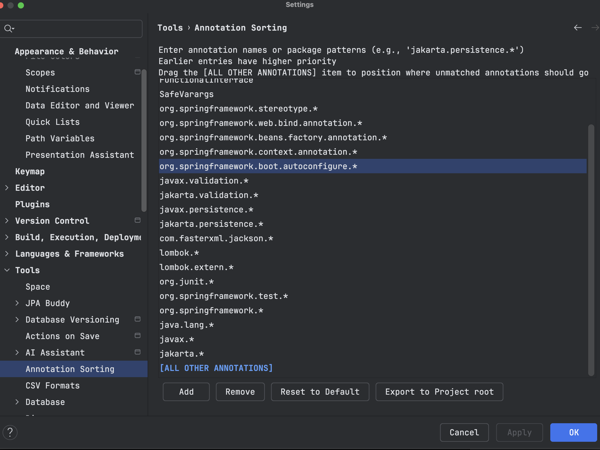
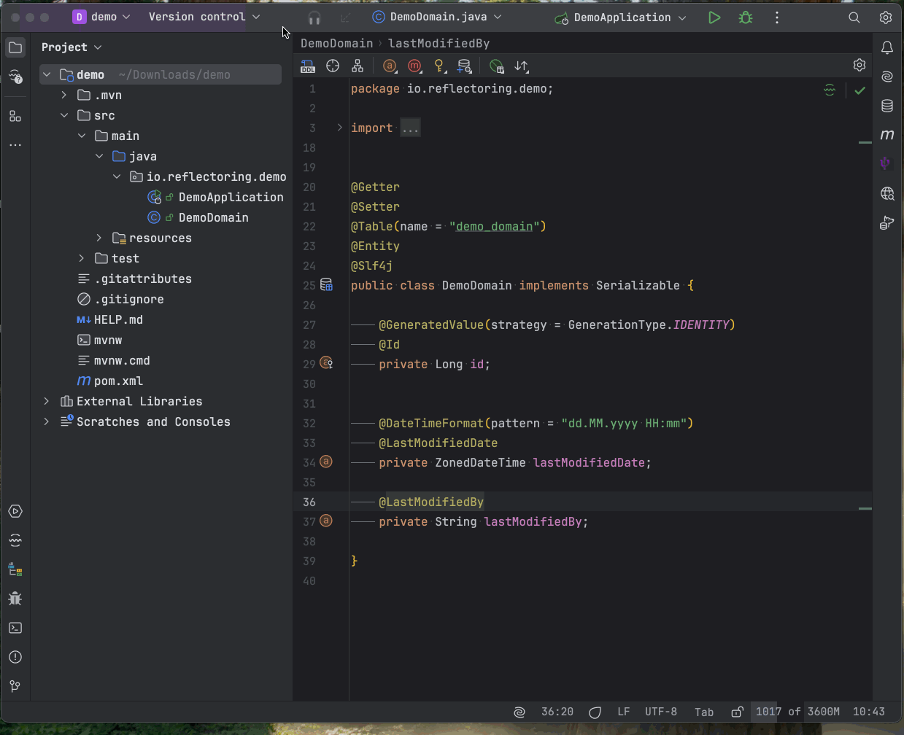

<!-- Plugin description -->
# 🔀 Java Annotation Sorter

**Annotation Sorter** is an IntelliJ plugin that helps you keep all your annotations organized and consistent by automatically reordering them based on your preferences, 🚀 clean annotations improve readability and reduce noise in code reviews
  

---

## ✨ Features

- ✅ **Drag-and-Drop Annotation Sorting via Settings**
  - Settings → Tools → Annotation Sorting
  - Define the exact order for **annotations** with drag-and-drop UI.

- 🏷️**Flexible Sorting Rules**:
    - Define custom sorting rules for annotations based on **class names** (e.g. `@Deprecated` ) or **package patterns** (e.g. `org.springframework.*`).

- 🔌 **Seamless Integration**
  - The plugin integrates with IntelliJ’s built-in reformatting functionality, making it easy to reorder annotations automatically without additional steps or configuration.

- 📤 **Export/Import Settings**
  - Share your annotation style across teams by exporting your configuration to a JSON file in the project folder.

---

## **Donate to Support the Development**

If you find this plugin useful and want to support its ongoing development, please consider making a donation. Your contribution helps to keep this project alive and fund future improvements and features.

**Donate via PayPal**:  
 - akmal.sarhan@gmail.com

**Support Us on GitHub**:  
You can also sponsor the project or contribute in other ways via our GitHub page:  
[GitHub Repository](https://github.com/akmalSar/annotation-sorter-intellij-idea-plugin)

Thank you for your support!

<!-- Plugin description end -->
---

## 📸 Screenshots

> **Annotation Sorter Settings UI (Drag & Drop)**
>
> 

> **Before & After Annotation Reformat**
>
> 

---

## ⚙️ Configuration

1. Open **Settings → Tools → Annotation Sorter**.
2. Use drag-and-drop to define the desired order of annotations.
3. Export your settings to share with your team:  
   `File → Export Settings` or use the plugin’s **Export JSON** option.

---

## 📦 Installation

You can install the plugin directly from the **IntelliJ Plugin Marketplace**:

**Plugins → Marketplace → Search for “Annotation Sorter” → Install**

Or 👉 [Install this plugin from JetBrains Marketplace](https://plugins.jetbrains.com/plugin/27055)

---

## 🤝 Share & Collaborate

Keep everyone on the same page. Export your settings and commit them to your repo so your entire team benefits from a consistent annotation style.

---

